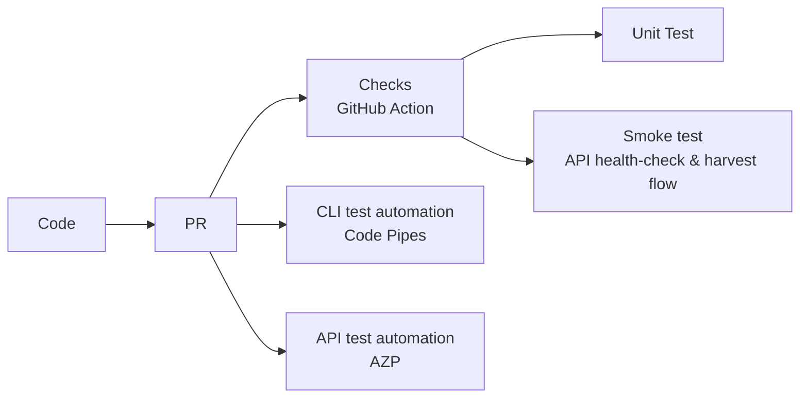
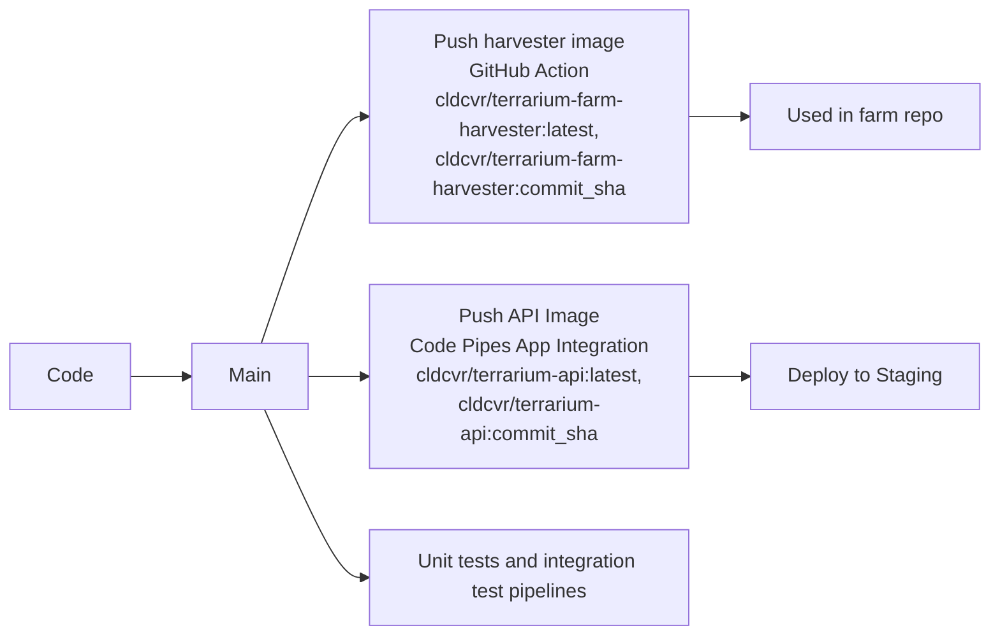
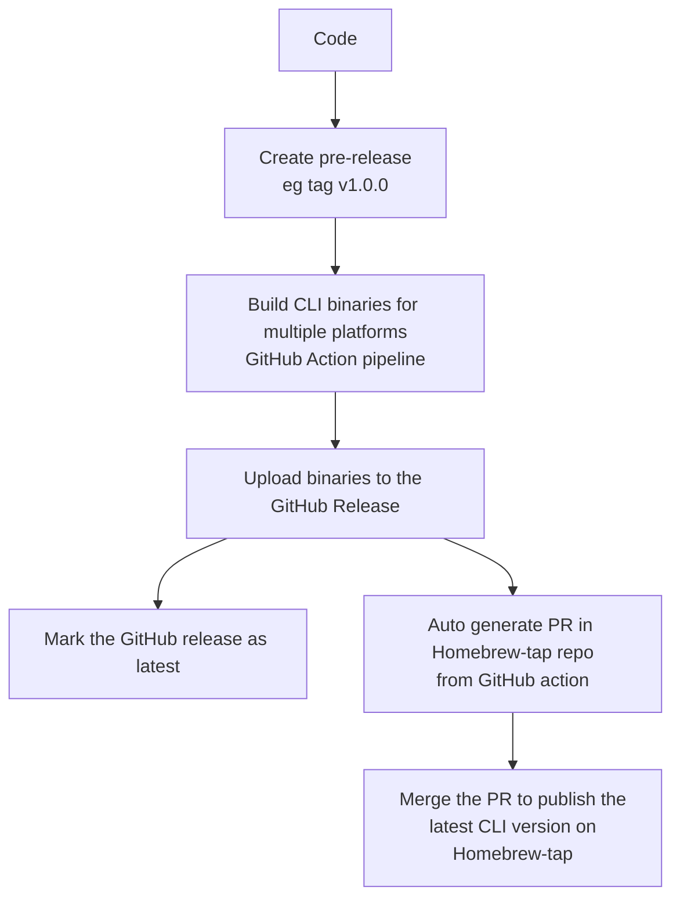

# Automaton flows on repository

The Terrarium repo has various automation flows in place. Mainly there are three events that trigger the automation in this repo:

1. New Pull request
1. Merge to the base branch (main)
1. Create new release tag (v*)

## 1. New pull request

The intent of automation pipelines here is to validate the changes coming from the pull requests.

## 2. Merge to the base branch (main)

There are two automation intents that run on merge to master:

### 1. Validation

This is same as the PR checks, but is important here to ensure sanity of the code merge.

### 2. Build container images and deploy to staging

The terrarium repo produces two docker images:

- **docker.io/cldcvr/terrarium-api** - Terrarium API image is used to deploy the API server. It is based on alpine and contains the go binary for server.
- **docker.io/cldcvr/terrarium-farm-harvester** - Terrarium Harvester image is based on terraform image and contains Terrarium CLI binary built in along with a Makefile that contains sequence of running the terraform harvest commands.

## 3. Create new release tag (v*)

The release process currently deals with releasing a new version of Terrarium CLI binary. The Terrarium API doesn't have a Prod release (or deployment) setup currently.

When creating a new version release in GitHub, mark it as "Pre-release", then wait for the pipelines to finish, and you should see the release assets uploaded. Then make a business decision to publish the release, and do two things to publish the release:

1. Label the GitHub release as "latest"
2. Merge the auto generated PR in [homebrew-tap](https://github.com/cldcvr/homebrew-tap) repo. - This step is responsible for publishing the new version in Homebrew for all the users that use Homebrew for CLI installation
