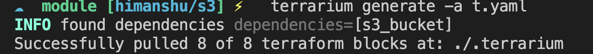
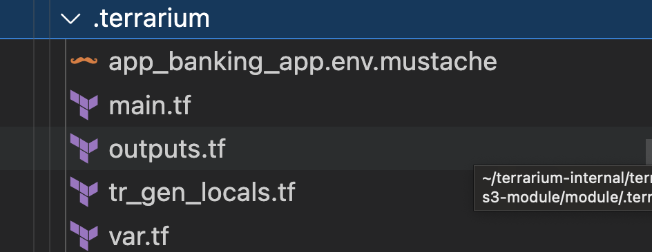

## Getting started with Devops perspective

> For Devops we have terraform modules already created. You can check them in below path

```
examples/platform-demo/platform
```

### How to write a basic platform ??

#### Let say we have a requirement for s3 bucket.
#### Steps

Step 1: Pick up a module for anywhere for eg: i have picked it up from terraform registry
> source : https://registry.terraform.io/modules/terraform-aws-modules/s3-bucket/aws/latest

Step 2: Create a main.tf file and paste it like below

```
module "tr_component_s3_bucket" {
  source = "terraform-aws-modules/s3-bucket/aws"


  for_each = local.tr_component_s3_bucket
  bucket = each.value.bucket
  acl    = var.acl

  control_object_ownership = var.control_object_ownership
  object_ownership         = var.object_ownership

  versioning = var.versioning
  }
```

Step 3: Now change it according to your platform requirement. Suppose you want to take bucket name from developer and you want all the remaining values to be same so your main.tf will be like below.

```
locals{
    tr_component_s3_bucket = {
        "default" : {
         "bucket" : "terrarium-test-bucket"
        }
    }
}

module "tr_component_s3_bucket" {
  source = "terraform-aws-modules/s3-bucket/aws"


  for_each = local.tr_component_s3_bucket
  bucket = each.value.bucket
  acl    = var.acl

  control_object_ownership = var.control_object_ownership
  object_ownership         = var.object_ownership

  versioning = var.versioning
  }

output "tr_component_s3_bucket_id" {
    value = {for k, v in module.tr_component_s3_bucket : k => v.s3_bucket_id }
}
output "tr_component_s3_bucket_arn" {
    value = {for k, v in module.tr_component_s3_bucket : k => v.s3_bucket_arn }
}
```
> [!IMPORTANT]
> For arguments you see in the above code  tr_components_ works with modules , locals and outputs for now so if you want to take arguments from developer just define it in locals  as shown  above 

### Generate terrarium.yaml file from terraform code

```
terrarium platform lint
```

### Generated terrarium yaml file 


```
components:
    - id: s3_bucket
      title: S3 Bucket
      inputs:
        type: object
        properties:
            bucket:
                title: Bucket
                type: string
                default: terrarium-test-bucket
      outputs:
        type: object
        properties:
            arn:
                title: Arn
            id:
                title: Id
graph:
    - id: local.tr_component_s3_bucket
      requirements: []
    - id: module.tr_component_s3_bucket
      requirements:
        - local.tr_component_s3_bucket
        - var.acl
        - var.control_object_ownership
        - var.object_ownership
        - var.versioning
    - id: output.tr_component_s3_bucket_arn
      requirements:
        - module.tr_component_s3_bucket
    - id: output.tr_component_s3_bucket_id
      requirements:
        - module.tr_component_s3_bucket
    - id: var.acl
      requirements: []
    - id: var.control_object_ownership
      requirements: []
    - id: var.object_ownership
      requirements: []
    - id: var.versioning
      requirements: []
```

> [!IMPORTANT]
> The generated terrarium file shown above is  the configuration yaml which is the metadata of your platform.

### how do we write yaml file(the file that will be written by a developer) to get this platform we just created ??

#### Steps

Step 1: Create a yaml file lets say banking_app_s3_bucket.yaml. Checkout the code snnipet below

```
id: banking_app
name: Banking App
env_prefix: BA

dependencies:
  - id: ledgerdb
    use: s3_bucket
    inputs:
      bucket: ollion-banking-app-bucket
```
##### Arguments description

|  Arguments  |  description |
|  -----  |  ----------- |
|  id(root) |  A required identifier for the app in the project. It must start with an alphabet character, can only contain alphanumeric characters, and must not exceed 20 characters in length. |
|  name   | A human-friendly name for the application. |
|  env_prefix | The prefix used for environment variables in this app. If not set, it defaults to an empty string. |
|  id(under dependencies) |   A required identifier for the dependency in the project. It must start with an alphabet character, can only contain alphanumeric characters, and must not exceed 20 characters in length.         |
|  use     | Indicates the specific dependency interface ID that is used as an app dependency. It may include version as short-hand expression instead of adding version to the inputs block.  |
|  inputs  |  Represents customization options for the selected dependency interface. It is a key-value map where the keys represent the input names, and the values represent the corresponding input values. |

Step 2: Generate the .terrarium folder which consist of your platform through banking_app_s3_bucket.yaml file

```
terrarium generate -a t.yaml
```




And you are all set to apply and deploy your platform :tada:

#### References

https://github.com/cldcvr/terrarium/blob/himanshu/s3/src/pkg/metadata/app/readme.md


