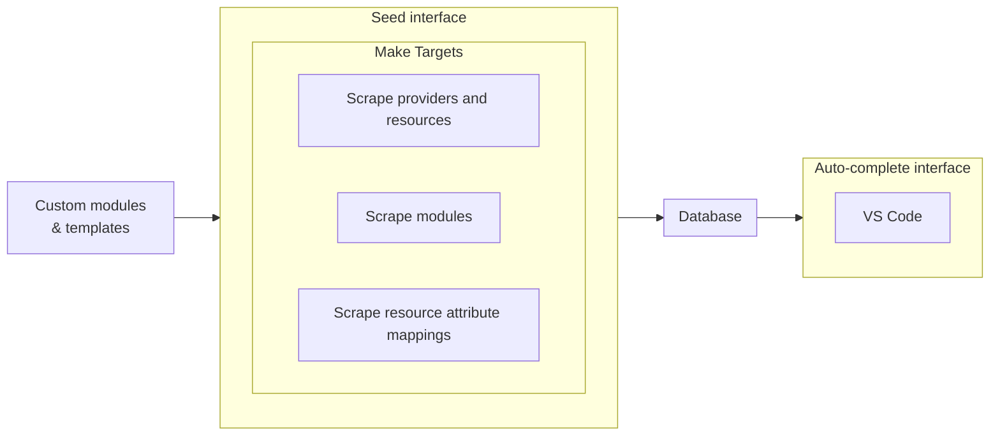

# Terrarium

## Architecture diagram

```mermaid
flowchart LR
    C["Custom modules\n & templates"]
    V["VS Code"]
    C --> S --> I --> A
    subgraph S["Seed interface"]
        direction TB
        subgraph M["Make Targets"]
            M1["Scrape providers and resources"]
            M2["Scrape modules"]
            M3["Scrape resource attribute mappings"]
        end
    end
    subgraph I["Database"]
        direction TB
    end
    subgraph A["Auto-complete interface"]
        direction TB
        V
    end

```
