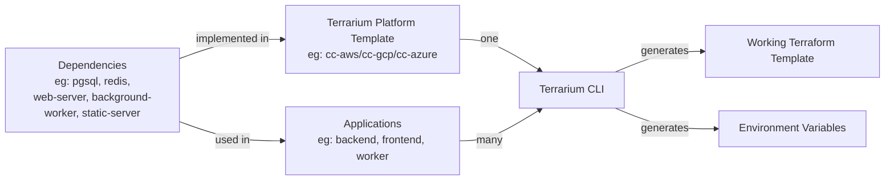
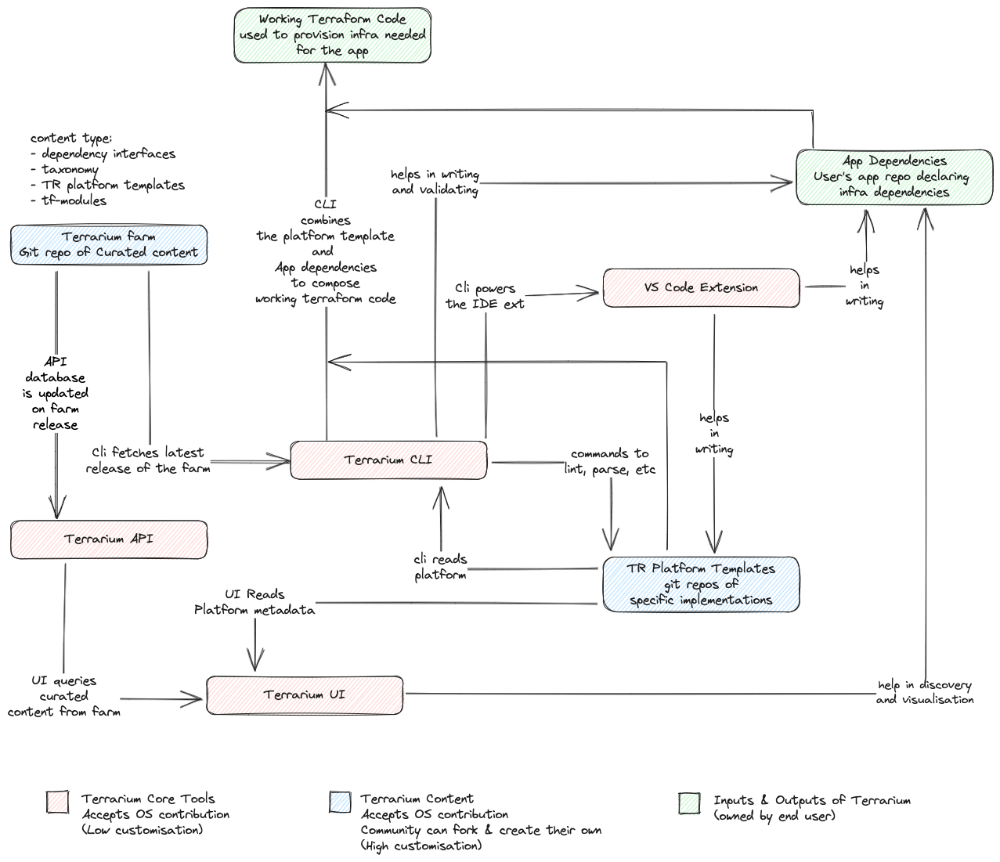
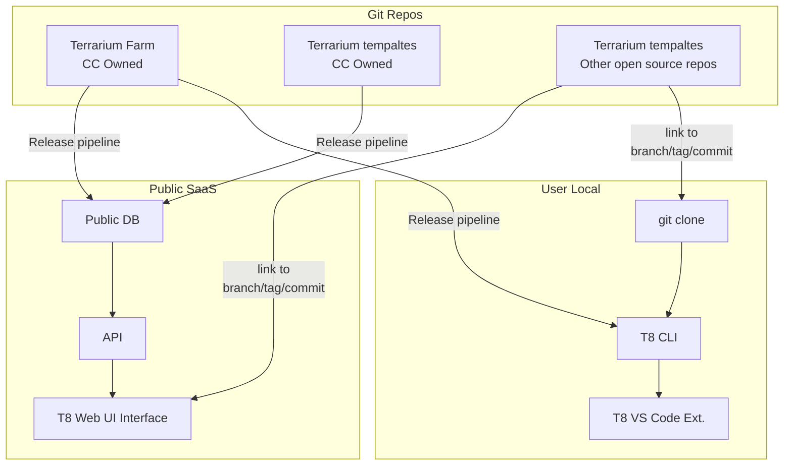

<a href="https://terrarium.cldcvr.com/">
  
</a>

[](https://terrarium.readme.io/docs/)
[](https://github.com/cldcvr/terrarium/actions/workflows/release.yaml)
[](https://github.com/cldcvr/terrarium/blob/main/LICENSE)
[](https://discord.gg/gG3gDm9GmF)
[](./CONTRIBUTING.md)

---

# Terrarium

The Terrarium project aims to empower platform engineering professionals by providing a comprehensive suite of tools for creating reusable Terraform templates. In the evolving landscape of DevOps, Terrarium aligns with the principles of [Internal Developer Platforms (IDP)](https://internaldeveloperplatform.org/), ensuring streamlined infrastructure provisioning and management.

## Installation Instructions

### Prerequisite

                                         

### Steps
1. Download [Terrarium](https://github.com/cldcvr/terrarium/releases) and extract the TAR archive.

   ```bash
   wget https://github.com/cldcvr/terrarium/releases/download/$VERSION/terrarium-$VERSION-linux-amd64.tar.gz
   ```

   Example:

```bash
  wget https://github.com/cldcvr/terrarium/releases/download/v0.4/terrarium-v0.4-macos-amd64.tar.gz
  tar -xzf terrarium-v0.4-macos-amd64.tar.gz
```

2. Move the `terrarium` binary to a directory in your system's PATH, like `/usr/local/bin/`.
   Add this to your shell:

   ```bash
   PATH="$PATH:/path/to/terrarium"
   ```

3. Alternatively, install using the source code.
   Clone this repo and execute:

   ```bash
   make install
   ```
> [!IMPORTANT]
> Make sure you have go version 1.20 or above if not try this link to download https://go.dev/dl/


4. Verify the Installation

   To check if Terrarium is installed correctly, open your terminal or command prompt and run:

   ```bash
   terrarium version
   ```

### Get Started with Terrarium

## Client Libraries

| Tool                                                                   | Description                                                          |
| ---------------------------------------------------------------------- | -------------------------------------------------------------------- |
| [VS Code Extension](https://github.com/cldcvr/terrarium-vscode-plugin) | Assists DevOps in writing Terraform code and managing dependencies.  |
| [CLI](./setup.md)                                                      | Command-line interface for working with Terrarium and app templates. |
| [Web UI](https://github.com/cldcvr/terrarium-frontend) (coming soon)   | User interface for visualizing Terrarium Platform Templates.         |
| [API](./src/api/) (internal)                                           | Internal query server for Terrarium Farm repo content.               |

## Concepts

- [App Manifest](./src/pkg/metadata/app/readme.md) - App Manifest provides a way for an applications to declare its infrastructure requirements using generic dependency interfaces. Such as, a working Terraform template can be generated at the time of deployment using the best practice defined in the Terrarium platform template.
- [Terrarium Dependency Interface](./src/pkg/metadata/dependency/readme.md) - The Terrarium Dependency Interface is an agreement that outlines how applications and Infrastructure as Code (IaC) interact. Dependencies are implemented in platforms and used in apps. A single dependency can be built into various platforms but only once per platform. However, an app can use the same dependency multiple times.
- [Terrarium Platform Framework](./examples/platform/readme.md) - The Terrarium Platform Framework helps make reusable templates with Terraform. A Terrarium Platform Template implements dependencies in an opinionated way, exposing only relevant controls to the app and generating a defined set of outputs for the app to use as environment variables.
- [Terrarium Farm](./examples/farm/readme.md) - The Terrarium Farm is a repository containing seed data like tf-modules, dependencies, taxonomy & platforms. The farm repository has workflows to ensure the sanity of the content as well as scan the content to extract key information. The Ollion maintained Farm repo is at [cldcvr/terrarium-farm](https://github.com/cldcvr/terrarium-farm).

## Flow

### Basic



### How it works

<div align="center">

</div>

### Repos & Deployment setup



## Progress

- [x] Release VS-Code extension with basic auto-complete from curated modules in the farm-repo.
- [x] Document the Terrarium Platform Framework and app dependencies format with examples.
- [x] Implement CLI command to lint & parse Terrarium Platform Templates.
- [x] Simplify the installation of Postgres & T8-API in Docker for the VS Code extension by integrating it into the CLI.
- [x] Develop CLI command to compose working Terraform templates using T8-Platform Templates & App Dependencies.
- [x] Enhance VS Code plugin to support auto-complete with local modules.
- [x] Add dependency-interfaces content to the farm-repo.
- [ ] Develop CLI & VS Code plugin features to assist developers in declaring infrastructure dependencies for their apps.
- [ ] Create a UI to help developers select App Dependencies by showcasing platform and farm insights.
- [ ] Add taxonomy mappings to the farm-repo.
- [ ] Enhance VS Code plugin to automatically implement dependency-interfaces in a platform (best guess).

## Get Involved

Join our Discord community - [**Terrarium Community**](https://discord.gg/gG3gDm9GmF).

Terrarium is still in its early stages, and we welcome your contributions.

To file a bug, suggest an improvement, or request a new feature please open an issue, refer to our [contributing guide](./CONTRIBUTING.md)
