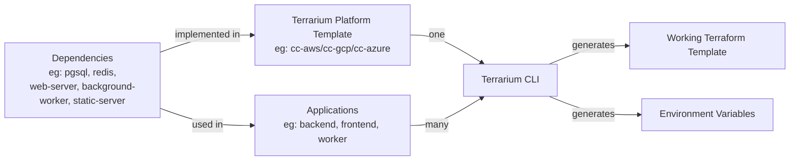
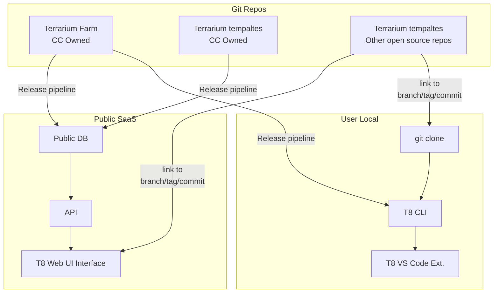

# Terrarium

The Terrarium project aims to empower platform engineering professionals by providing a comprehensive suite of tools for creating reusable Terraform templates. In the evolving landscape of DevOps, Terrarium aligns with the principles of [Internal Developer Platforms (IDP)](internaldeveloperplatform.org), ensuring streamlined infrastructure provisioning and management.

## Tools

- [VS Code Extension](https://github.com/cldcvr/terrarium-vscode-plugin) - Our VS Code extension is designed to assists DevOps in writing Terraform code and streamline infrastructure dependency declaration for the app Developers.
- [CLI](./setup.md) - Our command-line interface (CLI) offers a seamless experience for working with Terrarium. It includes commands for Terrarium Auto-Complete, leveraging the Terrarium Platform framework, adding dependencies to your applications, and ultimately composing a fully functional Terraform template by combining the Platform template and the app-specific dependencies.
- [Web UI](https://github.com/cldcvr/terrarium-frontend) (coming soon) - The UI component, currently in development, will provide comprehensive documentation and visual representations of the Terrarium Platform Templates, the implemented dependencies within the Platform, and platform insights. This will help DevOps professionals gain a clear overview of the platform template and assist developers in selecting appropriate dependencies.
- [API](./src/api/) (internal) - The API serves as a query server for the content in the Terrarium Farm repo. It is intended to be utilized by the Terrarium Web UI and is not intended for direct use. Therefore, it is an internal tool.

## Concepts

- [App Manifest](./src/pkg/metadata/app/readme.md) - App Manifest provides a way for any applications to declare its infrastructure requirements using generic dependency interfaces. Such that, a working terraform template can be generated at the time of deployment using the best practice defined in the terrarium platform template.
- [Terrarium Dependency Interface](./src/pkg/metadata/dependency/readme.md) - The Terrarium Dependency Interface is an agreement that outlines how applications and Infrastructure as Code (IaC) interact. Dependencies are implemented in platforms, and used in apps. A single dependency can be built into various platforms but only once per platform. However, an app can use the same dependency multiple times.
- [Terrarium Platform Framework](./examples/platform/readme.md) - The Terrarium Platform Framework helps make reusable templates with Terraform. A Terrarium Platform Template implements dependencies in an opinionated way exposing only relevant controls to the app and generate a defined set of outputs for the app to use as environment variables.
- [Terrarium Farm](./examples/farm/readme.md) - The Terrarium Farm is a repository containing seed data like tf-modules, dependencies, taxonomy & platforms. The farm repository has workflows to ensure sanity of the content as well as scan the content to extract key information. Cloud Cover owned Farm repo is maintained at [cldcvr/terrarium-farm](https://github.com/cldcvr/terrarium-farm).

## Flow

### Basic

### How it works

### Repos & Deployment setup

## Progress

- [x] Release VS-Code extension with basic auto-complete from curated modules in the farm-repo.
- [x] Document the Terrarium Platform Framework and app dependencies format with examples.
- [x] Implement CLI command to lint & parse Terrarium Platform Templates.
- [x] Simplify the installation of Postgres & T8-API in Docker for the VS Code extension by integrating it into the CLI.
- [x] Develop CLI command to compose working Terraform templates using T8-Platform Templates & App Dependencies.
- [x] Enhance VS Code plugin to support auto-complete with local modules.
- [x] Add dependency-interfaces content to the farm-repo.
- [ ] Develop CLI & VS Code plugin features to assist developers in declaring infrastructure dependencies for their apps.
- [ ] Create a UI to help developers select App Dependencies by showcasing platform and farm insights.
- [ ] Add taxonomy mappings to the farm-repo.
- [ ] Enhance VS Code plugin to automatically implement dependency-interfaces in a platform (best guess).

## Communication Channel

The Terrarium project is still in its early stages, and we value your support and feedback to shape the product into something that can make a real difference in the DevOps world.

We are just a slack away - `#terrarium-community`
