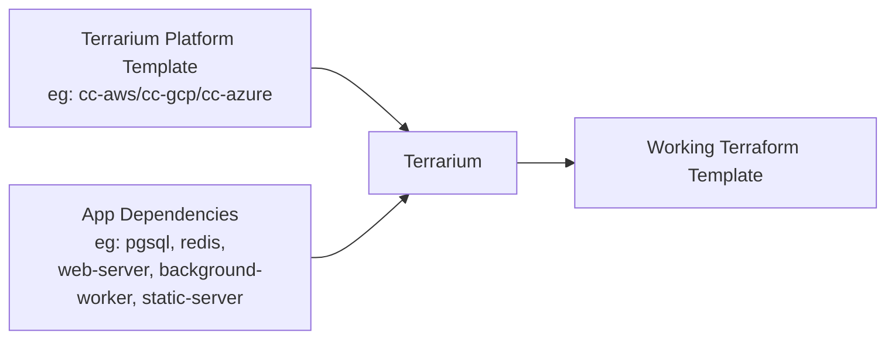
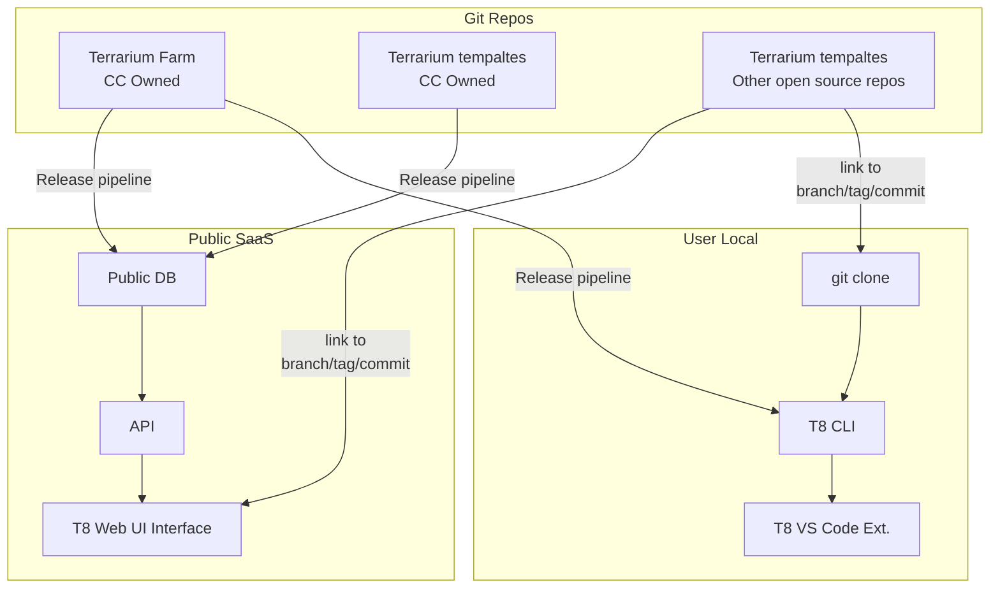

# Terrarium

The Terrarium project aims to empower DevOps professionals by providing a comprehensive suite of tools for creating reusable Terraform templates.

## Concepts

- [Terrarium Farm](./examples/farm/readme.md) - The Terrarium Farm is a curated collection of content that enables essential features such as generalization of infrastructure dependency interfaces, taxonomy management and auto-complete suggestions for terraform and app-dependencies. Cloud Cover owned Farm repo is maintained at [cldcvr/terrarium-farm](https://github.com/cldcvr/terrarium-farm)
- [Terrarium Platform Framework](./examples/platform/readme.md) - The Terrarium Platform Framework facilitates the creation of reusable Infrastructure as Code configurations using Terraform. Templates built using this framework are referred to as Terrarium Platform templates.
- [Terrarium App Metadata](./src/pkg/metadata/app/readme.md) - Terrarium App metadata provides a standardized way for applications to declare their infrastructure dependencies.

## Tools

- [CLI](./setup.md) - Our command-line interface (CLI) offers a seamless experience for working with Terrarium. It includes commands for Terrarium Auto-Complete, leveraging the Terrarium Platform framework, adding dependencies to your applications, and ultimately composing a fully functional Terraform template by combining the Platform template and the app-specific dependencies.
- [VS Code Extension](https://github.com/cldcvr/terrarium-vscode-plugin) - Our VS Code extension is designed to assists DevOps in writing Terraform code and streamline infrastructure dependency declaration for the app Developers.
- [Web UI](https://github.com/cldcvr/terrarium-frontend) (coming soon) - The UI component, currently in development, will provide comprehensive documentation and visual representations of the Terrarium Platform Templates, the implemented dependencies within the Platform, and platform insights. This will help DevOps professionals gain a clear overview of the platform template and assist developers in selecting appropriate dependencies.
- [API](./src/api/) (internal) - The API serves as a query server for the content in the Terrarium Farm repo. It is intended to be utilized by the Terrarium Web UI and is not intended for direct use. Therefore, it is an internal tool.

## Flow

### Basic

### How it works

### Repos & Deployment setup

## Progress

- [x] Released VS-Code extension with basic auto-complete from curated modules in the farm-repo.
- [x] Documented Terrarium Platform Framework and App dependencies format with example.
- [x] Implemented CLI Command to lint & parse Terrarium Platform Templates.
- [ ] Removing complexity of installing Postgres & T8-API in Docker to run VS Code extension, by abstracting it into CLI.
- [ ] Developing CLI Command to compose working Terraform templates using T8-Platform Templates & App Dependencies.
- [ ] Improving VS Code Plugin to support auto-complete with local modules.
- [ ] Developing UI to assist developers in selecting App Dependencies by rendering platform and farm insights.
- [ ] Adding taxonomy & dependency-interfaces content to the farm-repo.
- [ ] Enhancing VS Code plugin to automatically implement dependency-interfaces in a platform (best guess).
- [ ] Developing CLI & VS Code Plugin features to help developers declare infrastructure dependencies for their apps.

## Communication Channel

The Terrarium project is still in its early stages, and we value your support and feedback to shape the product into something that can make a real difference in the DevOps world.

We are just a slack away - `#terrarium`
