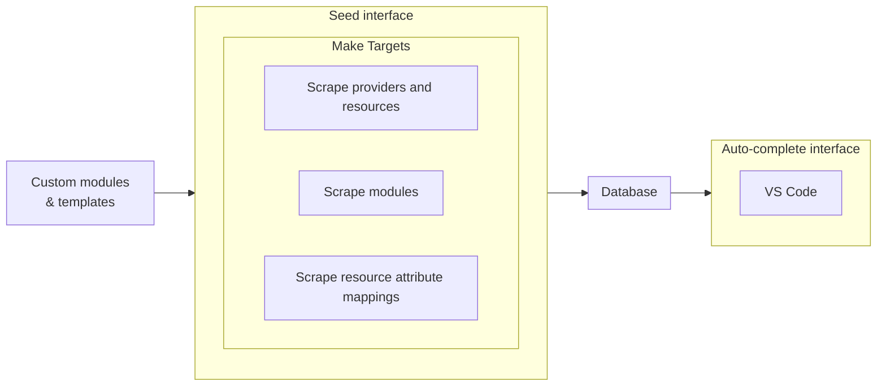

# Terrarium

## Architecture diagram



## Setup

Refer [setup.md](./setup.md)

## Example

The terrarium auto-complete API returns the following four modules linked together when asked for `rds`.

```tf
## TERRARIUM MODULE ## registry.terraform.io/terraform-aws-modules/vpc/aws ## vpc ## _TAXONOMY_ ##
module "vpc" {
  source = "registry.terraform.io/terraform-aws-modules/vpc/aws"
  version = "4.0.2"
  flow_log_cloudwatch_log_group_kms_key_id = module.kms.key_arn
}

## TERRARIUM MODULE ## registry.terraform.io/terraform-aws-modules/security-group/aws ## security-group ## _TAXONOMY_ ##
module "security-group" {
  source = "registry.terraform.io/terraform-aws-modules/security-group/aws"
  version = "5.1.0"
  vpc_id = module.vpc.vpc_id
}

## TERRARIUM MODULE ## registry.terraform.io/terraform-aws-modules/kms/aws ## kms ## _TAXONOMY_ ##
module "kms" {
  source = "registry.terraform.io/terraform-aws-modules/kms/aws"
  version = "1.0.2"
}

## TERRARIUM MODULE ## registry.terraform.io/terraform-aws-modules/rds/aws ## rds ## _TAXONOMY_ ##
module "rds" {
  source = "registry.terraform.io/terraform-aws-modules/rds/aws"
  version = "5.1.1"
  subnet_ids = module.vpc.database_subnets
  vpc_security_group_ids = module.security-group.security_group_id
  cloudwatch_log_group_kms_key_id = module.kms.key_arn
}
```

The `subnet_ids = module.vpc.database_subnets` could be something else since there are multiple available mappings for subnet_ids in vpc module, like:

- elasticache_subnets
- database_subnets
- redshift_subnets
- outpost_subnets
- public_subnets
- intra_subnets
- private_subnets
