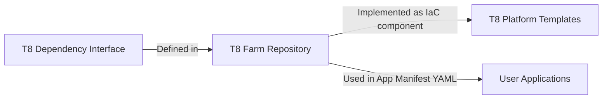

# Terrarium Dependency Interface

The Dependency Interface serves as a crucial Architecture Building Block within the Terrarium project. It provides essential information about infrastructure dependencies, including input and output schemas, titles, and descriptions. The format for input and output schemas adheres to the JSON schema specification.

## Overview

Once defined, the Dependency Interface acts as a contract between applications and Infrastructure as Code (IaC). It helps applications identify the required inputs for calling a dependency and the expected outputs. Simultaneously, it assists IaC in implementing the dependency by using the specified inputs and providing the declared outputs.

Dependency Interfaces are defined within the Terrarium farm repository, implemented as IaC components in Terrarium Platform Templates, and used within user applications as part of the App manifest YAML.



## Multi-Platform Implementation

Dependency Interfaces can be implemented across multiple platforms, allowing applications to deploy on different compatible platforms. For instance, platforms for AWS and GCP can both implement the same "postgres" interface. This flexibility enables applications to call the postgres dependency and expect it to function seamlessly on both AWS and GCP, as long as both platforms implement the same dependency interface.

## YAML Attributes

Each Dependency Interface is defined using several YAML attributes:

- `id`: An identifier for the dependency interface. This identifier is referenced by the app manifest to "use" the dependency interface and is used in the Terrarium Platform Template to "implement" the dependency interface as an IaC component.
- `title`: A human-readable title for the dependency.
- `description`: A detailed description of the dependency, explaining its purpose and functionality.
- `inputs`: The schema for the inputs required by the dependency. This schema follows the [JSON Schema specification](https://json-schema.org/).
- `outputs`: The schema for the outputs produced by the dependency. Like `inputs`, this schema definition is also based on the JSON Schema specification.

## Example

Here's an example of a Dependency Interface for a PostgreSQL database:

```yaml
dependency-interfaces:
  - id: postgres
    title: PostgreSQL Database
    description: A relational database management system using SQL.
    inputs:
      type: object
      properties:
          db_name:
              title: Database name
              description: The name provided here may get prefix and suffix based on specific configurations.
              type: string
              default: random
          version:
              title: Engine version
              description: Version of the PostgreSQL engine to use.
              type: string
              default: "11"
    outputs:
      properties:
          host:
              title: Host
              description: The host address of the PostgreSQL server.
              type: string
          password:
              title: Password
              description: The password for accessing the PostgreSQL database.
              type: string
          port:
              title: Port
              description: The port number on which the PostgreSQL server is listening.
              type: number
          username:
              title: Username
              description: The username for accessing the PostgreSQL database.
              type: string
```

In this example, the Dependency Interface defines the inputs and outputs for a PostgreSQL database, including the database name, engine version, host address, password, port number, and username.

Additional examples of the file format can be found [here](../../../../examples/farm/dependencies).
