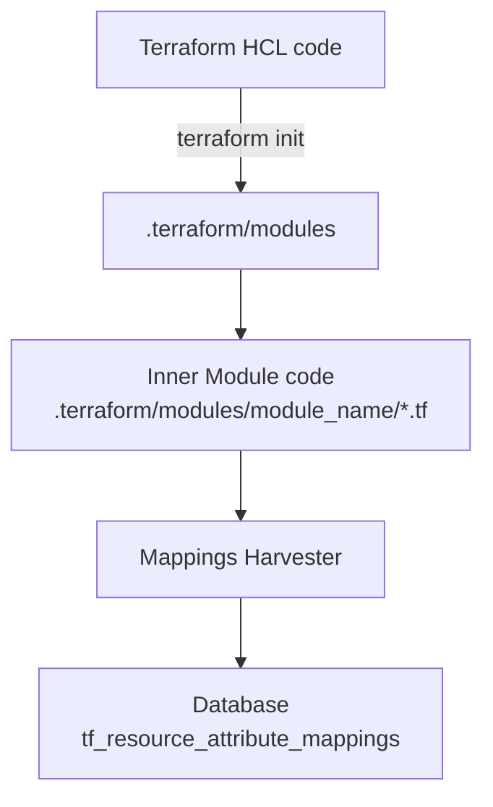

# Terraform Mappings Harvester

The Terraform Mappings Harvester is a specialized tool designed to parse Terraform code and its modules to identify and scrape resource attribute mappings.

## Working



The Terraform Mappings Harvester operates through a series of steps to identify and extract resource attribute mappings from Terraform code. The process, as visualized in the above Mermaid diagram, involves the following key stages:

1. **Terraform HCL Code Processing**:
   - The process begins with the Terraform HCL (HashiCorp Configuration Language) code.
   - The user runs `terraform init` on their Terraform code. This command is crucial for initializing a Terraform working directory, which includes downloading and setting up the necessary modules.

2. **Extraction of Inner Module Code**:
   - The initialization process creates a `.terraform/modules` directory.
   - Within this directory, the Harvester focuses on the inner module code, which is located in `.terraform/modules/module_name/*.tf`. These files contain the actual Terraform code for each module used in the project.
   - This step is critical as it involves parsing the Terraform files to identify the resource attribute mappings.

3. **Mappings Harvester Processing**:
   - The Mappings Harvester then processes the extracted module code.
   - It systematically scans through the `.tf` files, identifying and extracting mappings between input and output resource attributes. For example, it can detect a mapping like `aws_security_group.vpc_id = aws_vpc.id`, indicating that the `vpc_id` attribute of `aws_security_group` maps to the `id` attribute of `aws_vpc` by analyzing at a code block like this:

    ```tf
    resource "aws_security_group" "dbsg" {
      name        = "db"
      description = "security group for db"
      vpc_id      = aws_vpc.demo.id
    }
    ```

4. **Storing in Database**:
   - After processing, the Harvester stores the identified mappings in a database.
   - The database contains a table like `tf_resource_attribute_mappings`, where the mappings between resource attributes are recorded.
   - This structured storage allows for efficient querying and analysis of the resource attribute mappings.

## Usage

### Command Syntax

To use the Terraform Mappings Harvester, run the following command:

```sh
terrarium harvest mappings --dir <path-to-terraform-directory>
```

Replace `<path-to-terraform-directory>` with the actual path to your Terraform project.

#### Additional Flags

- **Module List File** (`--module-list-file`): Specify a file listing the modules to be processed. This is useful for analyzing multiple modules.

- **Working Directory** (`--workdir`): Define a directory for storing module sources. This improves performance by reusing data between commands, especially beneficial when processing multiple modules.

### Direct Scraping

To scrape mappings directly from a Terraform directory:

1. **Run the Harvester**:

    ```sh
    terrarium harvest mappings --dir <path-to-terraform-directory>
    ```

    This command will parse the Terraform code in the specified directory and identify resource attribute mappings.

### Using a Module List File

To scrape mappings using a module list file:

1. **Prepare a Module List File**: Create a file listing the modules you want to process. Refer to the [module list file documentation](https://github.com/cldcvr/terrarium/blob/main/src/pkg/metadata/modulelist/readme.md) for the format and details.

2. **Run the Harvester**:

    ```sh
    terrarium harvest mappings --module-list-file <path-to-module-list-file>
    ```

    This command will process only the modules specified in the module list file.

## Monitoring Execution

Monitor the harvester's execution through the console output. It will provide progress messages and any errors encountered during the scraping process.
