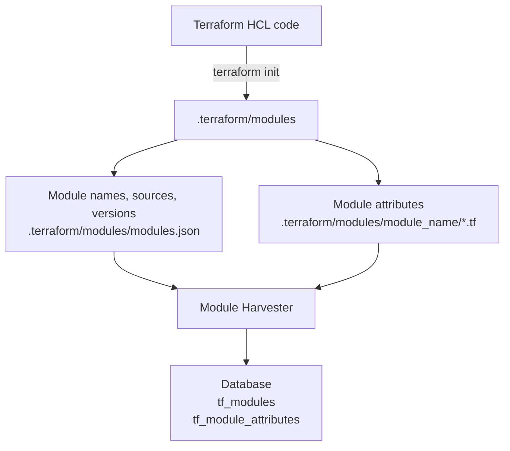

# Terraform Modules Harvester

The Terraform Modules Harvester is a tool designed to scrape Terraform modules and their attributes from a specified directory or a list of modules.

## Working



The Terraform Modules Harvester operates through a series of steps to extract information about Terraform modules and their attributes. The process is visualized in the above Mermaid flowchart and can be described as follows:

1. **Terraform HCL Code Processing**:
   - The process begins with the Terraform HCL (HashiCorp Configuration Language) code.
   - The user runs `terraform init` on their Terraform code. This command initializes a Terraform working directory by downloading and installing the necessary providers and modules.

2. **Extraction of Module Information**:
   - The initialization process creates a `.terraform/modules` directory.
   - Within this directory, two key sources of information are generated:
     - **Module Information File (`modules.json`)**: This file, located at `.terraform/modules/modules.json`, contains details about module names, sources, and versions. It acts as a central repository of metadata about the modules used in the Terraform code.
     - **Module Attributes**: For each module, there are HCL files (`.tf` files) within the module's directory (e.g., `.terraform/modules/module_name/*.tf`). These files hold the specific attributes and configurations of each module.

3. **Module Harvester Processing**:
   - The Module Harvester tool, processes the information extracted from the `.terraform/modules` directory.
   - It reads both the module information from `modules.json` and the module attributes from the individual `.tf` files.
   - This step translates the raw data from the Terraform configuration and module files into structured information.

4. **Storing in Database**:
   - Once the Module Harvester has processed the information, it stores the results in a database.
   - The database consists of tables like `tf_modules` and `tf_module_attributes`, where the harvested data about modules and their attributes is organized and stored for further use or analysis.

## Usage

### Modes of Operation

The scraper can be operated in two distinct modes:

1. **Direct Scraping from Terraform Directory**: This mode directly scrapes modules from a specified Terraform directory.

2. **Using a Module List File**: This mode processes modules listed in a provided module list file.

### Prerequisites

- **Terraform**: Ensure Terraform is installed and accessible.

### Direct Scraping

To scrape modules directly from a Terraform directory:

1. **Initialize Terraform**: Ensure you have run `terraform init` in your Terraform project directory.

2. **Run the Scraper**:

    ```sh
    terrarium harvest modules --dir <path-to-terraform-directory>
    ```

    Replace `<path-to-terraform-directory>` with the actual path to your Terraform project.

#### Additional Flags

- **Enable Local Modules** (`--enable-local-modules`): Include locally referenced modules in the scraping process with project directory path as the namespace. This is a boolean flag.

### Using a Module List File

To scrape modules using a module list file:

1. **Prepare a Module List File**: Create a file listing the modules you want to process. Refer to the [module list file documentation](https://github.com/cldcvr/terrarium/blob/main/src/pkg/metadata/modulelist/readme.md) for the format and details.

2. **Run the Scraper**:

    ```sh
    terrarium harvest modules --module-list-file <path-to-module-list-file>
    ```

    Replace `<path-to-module-list-file>` with the path to your module list file.

#### Additional Flags

- **Working Directory** (`--workdir`): Specify a directory for storing module sources. This improves performance by reusing data between running commands for the multiple modules in the list file.

### Monitoring Execution

Monitor the scraper's execution through the console output. It will provide progress messages and any errors encountered during the scraping process.
