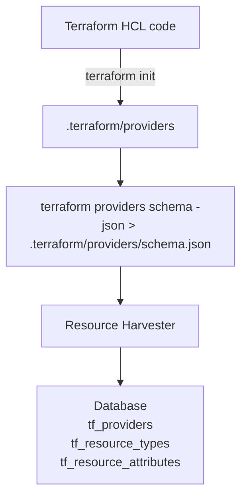

# Terraform Resource Harvester

This program processes the Terraform providers schema and stores it in a database. It extracts information about providers, resource types, and attributes from the schema file or module list and creates corresponding database entries.

## Working



The Terraform Resource Harvester is designed to process Terraform provider schemas and store the extracted information in a database. The workflow, as depicted in the above Mermaid diagram, involves several key steps:

1. **Terraform HCL Code Processing**:
   - The process starts with the Terraform HCL (HashiCorp Configuration Language) code.
   - The user executes `terraform init` on their Terraform code. This command is essential for initializing a Terraform working directory, which involves downloading and installing the necessary providers.

2. **Generation of Provider Schema**:
   - After initialization, the next step is to generate the provider schema.
   - This is achieved by running the command `terraform providers schema -json > .terraform/providers/schema.json`.
   - This command extracts the schema of all the providers used in the Terraform code and outputs it in JSON format to the file `.terraform/providers/schema.json`.
   - The schema file contains detailed information about the providers, including the resource types and attributes that each provider supports.

3. **Resource Harvester Processing**:
   - The Resource Harvester then takes over, processing the information contained in the `schema.json` file.
   - It reads and interprets the data, focusing on extracting key details about the providers, their resource types, and the attributes of each resource type.

4. **Storing in Database**:
   - The final step involves storing the processed information in a database.
   - The database is structured with tables like `tf_providers`, `tf_resource_types`, and `tf_resource_attributes`.
   - These tables are populated with the data extracted by the Resource Harvester, organizing it in a way that facilitates easy access and analysis.

## Usage

### Modes of Operation

The program can be run in two modes:

1. **Using a Pre-generated Provider Schema File**: In this mode, you need to generate a schema file manually.

2. **Using a Module List File**: In this mode, the program will automatically run `terraform init` and generate the provider schema. This is useful if you want to process multiple modules.

### Prerequisites

Before running the program, ensure you have the following prerequisites:

1. **Terraform**: Terraform must be installed on your system.

### Generating Provider Schema File (First Mode)

If you choose the first mode of operation, follow these steps:

1. **Generate the Terraform providers schema file**: Run the following command in your Terraform project directory:

    ```sh
    terraform init
    terraform providers schema -json > .terraform/providers/schema.json
    ```

    This command will create a `schema.json` file containing the providers schema.

2. **Run the program**: Execute the main program file, providing the path to the generated `schema.json` file.

    ```sh
    terrarium harvest resources --schema-file .terraform/providers/schema.json
    ```

### Using a Module List File (Second Mode)

For the second mode, follow these steps:

1. **Prepare a Module List File**: Create a file listing the modules you want to process. Refer to the [module list file documentation](https://github.com/cldcvr/terrarium/blob/main/src/pkg/metadata/modulelist/readme.md) for the format and details.

2. **Run the program**: Execute the main program with the module list file.

    ```sh
    terrarium harvest resources --module-list-file <path-to-module-list-file>
    ```

    The program will automatically handle `terraform init` and schema generation for the modules listed.

### Monitoring Execution

Regardless of the mode, monitor the program execution as follows:

- **Execution Logs**: The program will log progress messages and errors to the console. Check the console output for information about the providers, resource types, and attributes processed.
