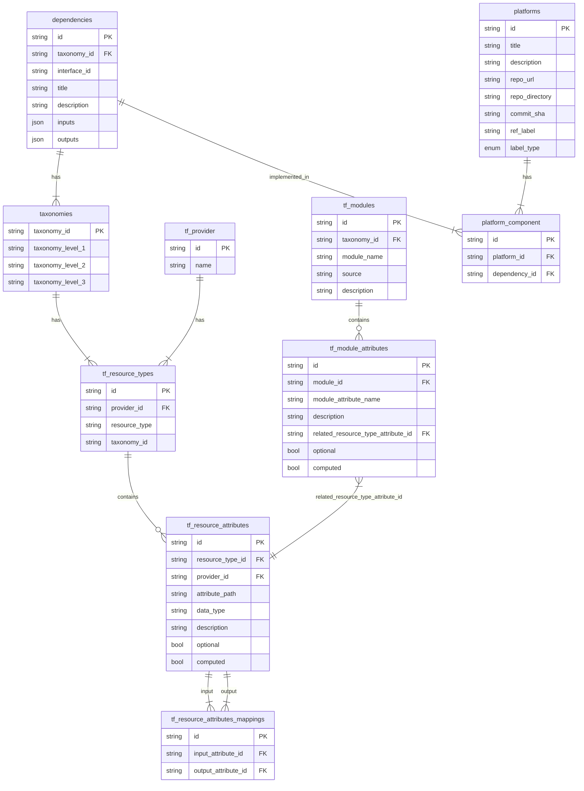

# Database

## ER Diagram

```mermaid
erDiagram
    "tf_provider" {
        string id PK
        string name
    }
    "tf_resource_types" {
        string id PK
        string provider_id FK
        string resource_type
        string taxonomy_id
    }
    "tf_resource_attributes" {
        string id PK
        string resource_type_id FK
        string provider_id FK
        string attribute_path
        string data_type
        string description
        bool optional
        bool computed
    }
    "tf_resource_attributes_mappings" {
        string id PK
        string input_attribute_id FK
        string output_attribute_id FK
    }
    "tf_modules" {
        string id PK
        string taxonomy_id FK
        string module_name
        string source
        string description
    }
    "tf_module_attributes" {
        string id PK
        string module_id FK
        string module_attribute_name
        string description
        string related_resource_type_attribute_id FK
        bool optional
        bool computed
    }
    "taxonomies" {
        string taxonomy_id PK
        string taxonomy_level_1
        string taxonomy_level_2
        string taxonomy_level_3
    }
    "dependencies" {
        string id PK
        string taxonomy_id FK
        string interface_id
        string title
        string description
        json inputs
        json outputs
    }
    "platforms" {
        string id PK
        string title
        string description
        string repo_url
        string repo_directory
        string commit_sha
        string ref_label
        enum label_type
    }
    "platform_component" {
        string id PK
        string platform_id FK
        string dependency_id FK
    }

    %% Define relationships
    "tf_resource_types" ||--o{ "tf_resource_attributes" : contains
    "tf_resource_attributes" ||--|{ "tf_resource_attributes_mappings" : input
    "tf_resource_attributes" ||--|{ "tf_resource_attributes_mappings" : output
    "tf_modules" ||--o{ "tf_module_attributes" : contains
    "tf_module_attributes" }|--|| "tf_resource_attributes" : related_resource_type_attribute_id
    "taxonomies" ||--|{ "tf_resource_types" : has
    "tf_provider" ||--|{ "tf_resource_types" : has
    "dependencies" ||--|{ "taxonomies" : has
    "dependencies" ||--|{ "platform_component" : implemented_in
    "platforms" ||--|{ "platform_component" : has
```
