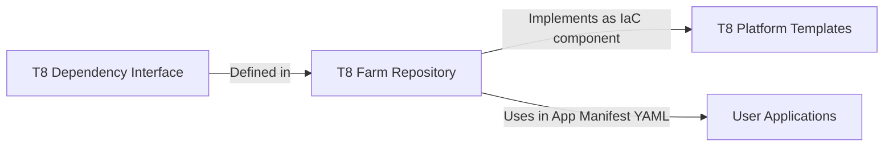

# Terrarium Dependency Interface

The Dependency Interface is a crucial Architecture Building Block in the Terrarium project. It defines the necessary information about an infrastructure dependency, such as the schema of inputs, schema of outputs, title and description. The format for Inputs and Outputs schema is based on the JSON schema spec.

## Overview

The Dependency Interface, once defined, serves as a contract between the application and Infrastructure as Code (IaC). It assists the application in identifying the inputs it needs to provide to call a dependency and the outputs it would receive from it. Conversely, it aids the IaC in implementing the dependency by utilizing the inputs and returning the declared outputs.

The Dependency Interfaces are defined in the Terrarium farm repository, implemented as IaC in the Terrarium Platform Templates, and used in user applications as part of the App manifest YAML.



## Multi-Platform Implementation

A Dependency Interface can be implemented across multiple platforms. This feature enables applications to be deployed on different compatible platforms. For instance, a platform for AWS and another for GCP can implement the same "postgres" interface. This implementation allows the application to freely call the postgres dependency and expect it to work on both AWS or GCP, as long as both platforms implement the same dependency interface.

## YAML Attributes

Each Dependency Interface is defined using several YAML attributes:

- `id`: Identifier of the dependency interface. This identifier is referred by the app manifest in order to "use" the dependency interface. And it is also used in the Terrarium Platform Template to "implement" the dependency interface as a IaC component.
- `title`: A human-readable title for the dependency.
- `description`: A detailed description of what the dependency is and what it does.
- `inputs`: The schema for the inputs that the dependency requires. This schema is defined based on the [JSON Schema specification](https://json-schema.org/)
- `outputs`: The schema for the outputs that the dependency produces. Like `inputs`, this schema definition is also based on the JSON Schema specification.

## Example

Below is an example of a Dependency Interface for a PostgreSQL database:

```yaml
dependency-interfaces:
  - id: postgres
    title: PostgreSQL Database
    description: A relational database management system using SQL.
    inputs:
      type: object
      properties:
          db_name:
              title: Database name
              description: The name provided here may get prefix and suffix based
              type: string
              default: random
          version:
              title: Engine version
              description: Version of the PostgreSQL engine to use
              type: string
              default: "11"
    outputs:
      properties:
          host:
              title: Host
              description: The host address of the PostgreSQL server.
              type: string
          password:
              title: Password
              description: The password for accessing the PostgreSQL database.
              type: string
          port:
              title: Port
              description: The port number on which the PostgreSQL server is listening.
              type: number
          username:
              title: Username
              description: The username for accessing the PostgreSQL database.
              type: string
```

In this example, the Dependency Interface defines the inputs and outputs for a PostgreSQL database, including the database name, engine version, host address, password, port number, and username.

Additional examples of the file format can be found here - [examples/farm/dependencies](../../../../examples/farm/dependencies)
