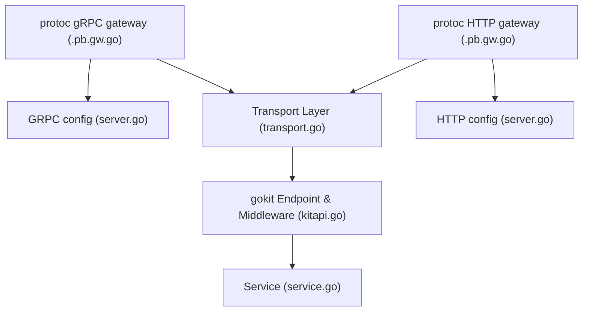

# Transport Helper

This package provides helpers for creating gRPC & HTTP servers using go-kit and protoc auto-generates gateways.

## Architecture

The API-Gateways autogenerated using protoc are used for starting up both for gRPC and HTTP servers.

The default server configuration is provided in `server.go`, while the default got-kit transport layer configuration is provided in `kitapi.go`

**Middleware** can be attached on three levels:

- go-kit Endpoints (`kitapi.go`): Middleware on this level runs on both servers (gRPC & HTTP)
- gRPC Server UnaryInterceptor (`server.go`): On this level, the given middleware only runs on the request coming on gRPC server
- HTTP Server Mux (`server.go`): On this level, the given middleware only runs on the request coming on HTTP server

